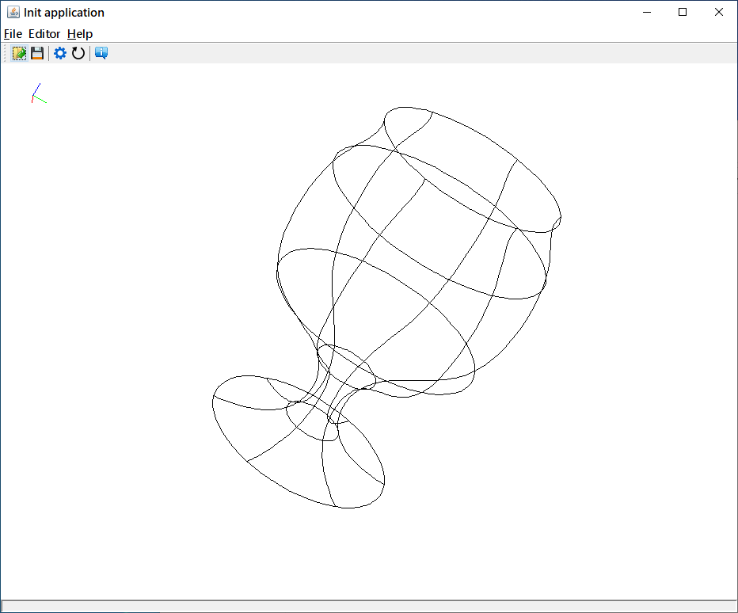
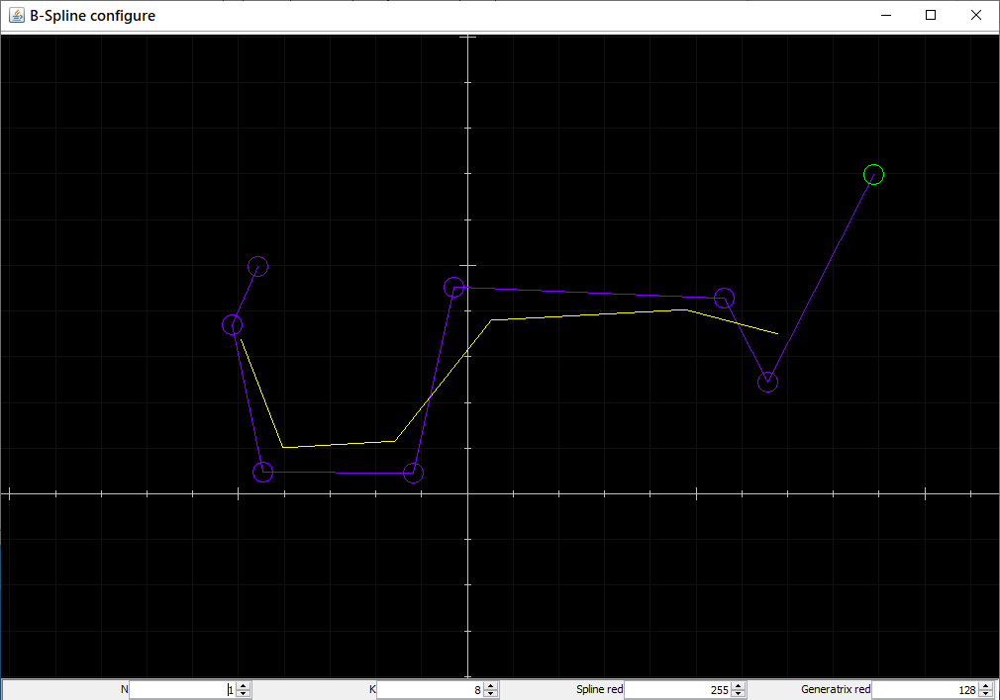
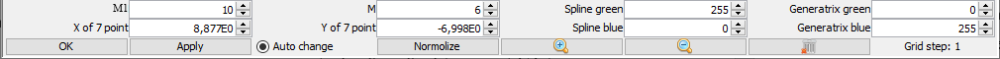
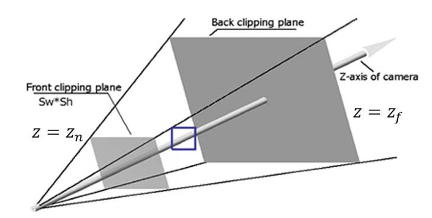

# ECGWireframe

Требуется разработать приложение для отображения в виде проволочной модели тела вращения с образующей, строящейся по задаваемым опорным точкам с помощью $B$-сплайна.

## Построение образующей с помощью $B$-сплайна

Образующая трехмерной фигуры вращения задается как двумерная ограниченная кривая, которая строится с помощью $B$-сплайна по заданным $K$ опорным точкам. Очередной $i$-й участок $B$-сплайна строится по четырём опорным точкам $\{P_{i-1}, P_i, P_{i+1}, P_{i+2}\}$ следующим образом:

$$
r_i(t) = T \cdot M_s \cdot G_s^i
$$

$$
T = \begin{bmatrix} t^3 & t^2 & t & 1 \end{bmatrix}
$$

$$
M_s = \frac{1}{6} \begin{pmatrix} -1 & 3 & -3 & 1 \\\\ 3 & -6 & 3 & 0 \\\\ -3 & 0 & 3 & 0 \\\\ 1 & 4 & 1 & 0 \end{pmatrix}
$$

$$
G_s^i = \begin{pmatrix} P_{i-1} \\\\ P_i \\\\ P_{i+1} \\\\ P_{i+2} \end{pmatrix}
$$

По $K$ опорным точкам можно построить $K − 3$ участков $B$-сплайна (при этом края участков сшиваются максимально гладко). В задаче требуется «приблизить» каждый участок $B$-сплайна ломаной из $N$ отрезков. Для этого необходимо интервал $[0, 1]$ параметра $t$ разделить на $N$ равных частей и получить для каждого $t = j/N$ точку $r_{ij}$ на плоскости.

Учитывая первую и последнюю точки для каждого участка $B$-сплайна, получим $N + 1$ точек, по которым можно нарисовать $N$ отрезков.

Обратите внимание, что последняя точка $i$-го участка $B$-сплайна (с параметром $t = 1$) в точности совпадает с первой точкой ($i+1$)-го участка (с параметром $t = 0$), поэтому:

- Число точек всех участков $B$-сплайна равно $N \times (K − 3) + 1$
- Общее число отрезков образующей равно $N \times (K − 3)$

Обозначим координатные оси в плоскости: $U$ – горизонтальная ось, $V$ – вертикальная. Для точек $P(u, v)$ итоговые формулы:

$$
u_i(t) = T \cdot M_s \cdot G_{su}^i, \quad G_{su}^i = \begin{pmatrix} u_{i-1} \\\\ u_i \\\\ u_{i+1} \\\\ u_{i+2} \end{pmatrix}
$$

$$
v_i(t) = T \cdot M_s \cdot G_{sv}^i, \quad G_{sv}^i = \begin{pmatrix} v_{i-1} \\\\ v_i \\\\ v_{i+1} \\\\ v_{i+2} \end{pmatrix}
$$

Пользователь должен иметь возможность задавать опорные точки образующей, а также параметры визуализации проволочной модели в отдельном диалоговом окне, вызываемом из основного окна программы. В редакторе образующей должны отображаться:

- координатные оси;
- опорные точки, соединённые линиями;
- образующая, состоящая из точек $B$-сплайна ($r_{ij}$), соединённых линиями.

Должна быть возможность добавлять новые опорные точки и удалять имеющиеся с помощью клика **правой кнопки мыши**. Опорные точки должны быть выделены окружностями и их можно динамически передвигать (зажимая **левую кнопку мыши**).

### Параметры редактора образующей

| Параметр | Описание                                                  | Ограничение     |
|----------|-----------------------------------------------------------|-----------------|
| $K$      | Число опорных точек                                       | $\ge 4$         |
| $N$      | Число отрезков для каждого участка $B$-сплайна            | $\ge 1$         |
| $M$      | Число образующих                                          | $\ge 2$         |
| $M1$     | Число отрезков по окружностям между соседними образующими | $\ge 1$         |

## Построение трехмерной модели в мировой системе координат

Построим фигуру вращения в пространстве $XYZ$, составив ее из $M$ образующих, повернутых вокруг оси $U$, соответствующей оси $Z$ в трехмерном пространстве. На первом шаге были получены $N \times (K - 3) + 1$ точек образующей, которые мы обозначим $F_i(u,v)$.

Будем разбивать полный угол поворота $360°$ на $M$ частей, тогда $j$-й угол поворота равен $\varphi_j = j \cdot 360° / M$. Для $i$-й точки образующей и для $j$-го угла поворота точка поверхности фигуры вращения $R_{ij}$ имеет следующие координаты в пространстве $XYZ$:

$$R_{ij\boldsymbol{x}} = F_{i\boldsymbol{v}} \cdot \cos\!\left(\frac{j \cdot 360}{M}\right)$$

$$R_{ij\boldsymbol{y}} = F_{i\boldsymbol{v}} \cdot \sin\!\left(\frac{j \cdot 360}{M}\right)$$

$$R_{ij\boldsymbol{z}} = F_{i\boldsymbol{u}}$$

Отображение поверхности фигуры вращения необходимо выполнить двумя наборами ломаных линий. Первый набор состоит из ломаных самих образующих ($M$ штук). Второй набор ломанных линий формирует окружности, проходящие через соответствующие точки соседних образующих. Эти окружности нужно строить только для точек образующих, соответствующих опорным точкам (концам участков $B$-сплайна). Соответственно, их количество будет равно $K - 2$.

Для того, чтобы при небольшом числе образующих окружности выглядели достаточно гладко, вводится параметр $M1$, который определяет число отрезков по окружностям между соседними образующими. Если $M1 = 1$, то соответствующие точки соседних образующих просто соединяются одним отрезком. В случае $M1 > 1$, для построения нескольких отрезков вместо одного нужно дополнительно найти $M1 - 1$ промежуточные точки, лежащие на соответствующей окружности и равномерно распределенные между рассматриваемыми соседними образующими.

После построения трехмерной фигуры в модельных координатах, нужно посчитать габаритный объем – габаритный бокс (ориентированный параллельно осям координат $XYZ$), т.е. минимальные и максимальные значения координат. Далее, сдвигаем и масштабируем фигуру с сохранением пропорций так, чтобы габаритный бокс был вписан в $[-1; 1] \times [-1; 1] \times [-1; 1]$.

Затем поворачиваем фигуру (набор отрезков) на заданные углы поворота по всем осям с помощью матрицы.

## Получение перспективной проекции

Визуализация выполняется в перспективной проекции – камера отстоит на расстоянии от центральной точки пространства $XYZ$ и направлена на построенную фигуру.

- $P_{cam} = (-10, 0, 0)$ – точка положения фокуса камеры.
- $P_{view} = (10, 0, 0)$ – точка, на которую смотрит камера (view point).
- $V_{up} = (0, 1, 0)$ – вектор направления вверх (up-vector).

Задаются следующие параметры пирамиды видимости и объёма визуализации:

- $z_n$ – расстояние до плоскости, на которую осуществляется проекция. Параметр меняет пользователь для изменения видимого размера объекта (зум).
- $z_f$ – расстояние до дальней клиппирующей плоскости. Обычно отображаются объекты, находящиеся между ней и ближней клиппирующей плоскостью, но в данной задаче это не требуется.
- $s_w$, $s_h$ – размеры ближней плоскости. Их отношение должно соответствовать размерам области отображения, на которой рисуется картинка для пользователя.

Обратите внимание, что эти параметры влияют на поле зрения (FOV). Подберите первоначальные значения так, чтобы отображаемая фигура была полностью видна и занимала большую часть экрана, при этом не было сильных неестественных искажений.

Для формирования итогового изображения фигуры вращения (набора отрезков) для пользователя нужно перейти из мировой ортогональной системы координат в систему координат камеры с преобразованием проецирования. Таким образом мы получим плоское изображение проекции, при этом третья невидимая координата будет содержать информацию о дальности до соответствующих точек от камеры. Остается только перевести полученные координаты в экранные координаты области отображения и нарисовать картинку из полученных отрезков для пользователя в основном окне приложения.

## Критерии оценки задания

### Обязательные требования

1. Размер окна приложения должен быть ограничен снизу 640×480.
2. Все функции кнопок, представленные на панели инструментов, должны быть продублированы элементами меню.
3. Все кнопки на панели инструментов должны иметь всплывающие подсказки.
4. Изменение параметров происходит в модальных диалоговых окнах. Должна присутствовать возможность отмены. Обязательно должна проверяться корректность введенных параметров. В случае ввода некорректных значений, приложение должно уведомить об этом пользователя и указать диапазон допустимых значений.
5. Должна присутствовать кнопка «О программе», показывающая диалоговое окно с информацией об авторе и программе.
6. Отсутствие необработанных исключений / падений приложения при работе.

### Требования на тройку

1. Должен быть реализован редактор образующей, позволяющий добавлять, удалять и двигать опорные точки с помощью мыши.
2. В редакторе образующей должны отображаться координатные оси.
3. Должна строиться и отображаться трехмерная фигура вращения из отрезков образующей, построенной по опорным точкам с помощью $B$-сплайна.
4. Отрезки, образующие окружности должны пересекаться с образующими при любых значениях параметров.
5. Должны настраиваться параметры $K$, $N$, $M$.
6. Должна быть реализована возможность интерактивно вращать фигуру с помощью мыши. При этом камера и ее направление фиксированы, их перемещать не нужно.
7. Должна применяться только матричная арифметика (для всех преобразований). Нужно формировать общую результирующую матрицу, а затем применять ее к исходным точкам.
8. При запуске программы должна быть задана и визуализирована какая-либо фигура.

### Требования на пятерку

1. Должны быть выполнены все обязательные требования (на тройку).
2. В редакторе образующей должна быть возможность двигать, масштабировать и автоматически нормировать изображение.
3. Должна быть реализована возможность сглаживания по окружностям (параметр $M1$).
4. На панели инструментов должна быть кнопка сброса углов поворота.
5. Вместе с фигурой в основном окне приложения нужно отображать оси $XYZ$ (с нужными углами поворота), можно в углу окна.
6. Должно быть реализовано преобразование проецирования. Итоговое изображение фигуры должно быть адекватным, без сильных искажений.
7. Должна быть реализована возможность зума с помощью изменения параметра $z_n$. Изменение параметра должно осуществляться интерактивно с помощью колёсика мыши.
8. Необходимо визуализировать дальность до отдельных отрезков (или самих пикселей) с помощью изменения цвета (можно делать дальние более блеклыми или другого цвета).
9. Должна быть возможность изменения размера основного окна программы вместе с областью отображения.
10. В редакторе образующей должна быть кнопка «Применить», при нажатии на которую редактор не закрывается, но сцена в основном окне приложения обновляется. Желательно сделать динамическое обновление, то есть при изменении опорных точек в редакторе, сразу же меняется и фигура вращения.
11. Должна быть возможность сохранения и открытия текущей фигуры и параметров (включая параметры отображения: поворот и зум) в файл. Формат файла сцены задаете самостоятельно. Программа должна корректно обрабатывать файлы, если файл не соответствует заданному формату или содержит некорректные данные, то не должно возникать ошибок, а должно появляться сообщение о некорректности выбранного файла.
